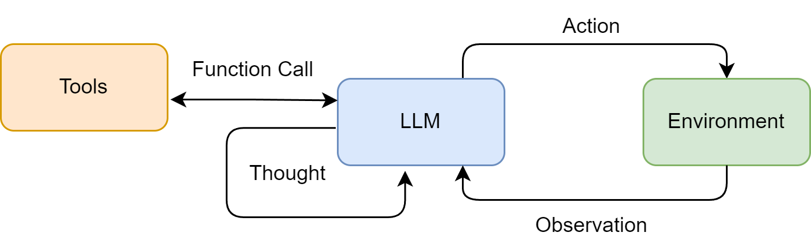
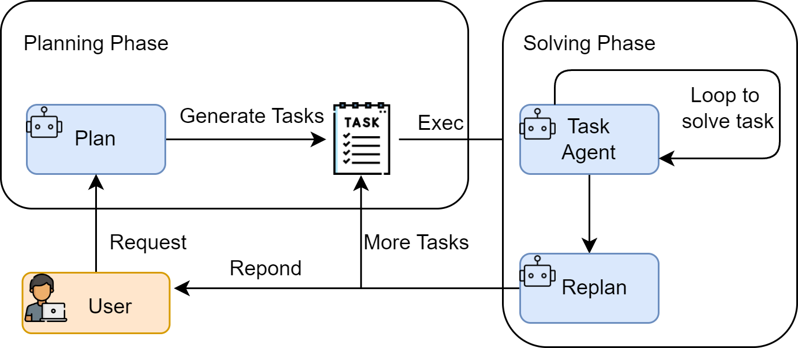

# 第四章 智能体经典范式构建


ReAct (Reasoning and Acting)： 边思考边做
Plan-and-Solve： 三思而后行
Reflection：反思

## 4.1 环境准备与基础工具定义
```py
pip install openai python-dotenv
```
调用函数 [llm_client.py](./llm_client.py)

## 4.2 ReAct
ReAct (Reason + Act),“思考-行动-观察” 循环

### 4.2.1 ReAct 的工作流程
 Thought(思考) -> Action（行动） -> Observation（观察结果） 的循环



### 4.2.2 工具（Tools）的定义与实现

```bash
pip install google-search-results

```

去 [serpapi](https://serpapi.com/) 注册账号，获取key，填到 SERPAPI_API_KEY

(1)实现搜索工具的核心逻辑
- 名称 (Name)
- 描述 (Description)：这是整个机制中最关键的部分，因为大语言模型会依赖这段描述来判断何时使用哪个工具
- 执行逻辑 (Execution Logic)：执行任务的函数

search函数[tools.py](./tools.py)

(2)构建通用的工具执行器
统一的管理器来注册和调度这些工具

[ToolExecutor](./tools.py)类


## 4.2.3 ReAct 智能体的编码实现
1. 系统提示词设计
上面定义了智能体和LLM交互规范
- 角色定义
- 工具清单 ({tools})
- 格式规约 (Thought/Action)
- 动态上下文 ({question}/{history})
2. 核心循环的实现

[ReAct.py](./ReAct.py) 的核心是一个循环，它不断地“格式化提示词 -> 调用LLM -> 执行动作 -> 整合结果”，直到任务完成或达到最大步数限制。

这里会将问题和工具都提供给ai。让ai根据问题选择工具，然后我们用工具执行结果，将结果再提供给ai。

## 4.2.4 ReAct 的特点、局限性与调试技巧
1. ReAct 的主要特点
- 高可解释性，看到每一步
- 动态规划与纠错能力 根据Observation，调整Thought 和 Action
- 工具协同能力，和外部工具结合起来。

关于缓存：

连续多次请求里，如果开头很长一段 token 完全一样（例如系统说明、长文档、工具 schema），厂商可能把这段的中间计算结果复用，只对新追加的后缀部分做完整计算。主要是重复前缀的算力/费用优化，不是泛指「模型自动记住一切」

2. ReAct 的固有局限性
- 对LLM自身能力的强依赖，看LLM能力
- 执行效率问题，完成一个任务通常需要多次调用 LLM
- 提示词的脆弱性，模板中的任何微小变动，都可能影响 LLM 的行为
- 可能陷入局部最优。缺乏一个全局的、长远的规划，可能选择看似正确但长远来看并非最优的路径，甚至死循环。

3. 调试技巧
- 检查完整的提示词。打印所有提示词
- 分析原始输出，打印所有输出
- 验证工具的输入与输出，单独验证工具
- 调整提示词中的示例。加入一两个完整的“Thought-Action-Observation”成功案例
- 尝试不同的模型或参数


# 4.3 Plan-and-Solve

将任务处理明确地分为两个阶段：先规划 (Plan)，后执行 (Solve)

## 4.3.1 Plan-and-Solve 的工作原理
1. 规划阶段 (Planning Phase)，将问题分解，并制定出一个清晰、分步骤的行动计划
2. 执行阶段 (Solving Phase)，严格按照计划中的步骤，逐一执行调用。



适用于：
- 多步数学应用题：需要先列出计算步骤，再逐一求解。
- 需要整合多个信息源的报告撰写：需要先规划好报告结构（引言、数据来源A、数据来源B、总结），再逐一填充内容。
- 代码生成任务：需要先构思好函数、类和模块的结构，再逐一实现。

## 4.3.2 规划阶段
我们的目标问题是：“一个水果店周一卖出了15个苹果。周二卖出的苹果数量是周一的两倍。周三卖出的数量比周二少了5个。请问这三天总共卖出了多少个苹果？”

1. 规划阶段：首先，将问题分解为三个独立的计算步骤（计算周二销量、计算周三销量、计算总销量）。
2. 执行阶段：然后，严格按照计划，一步步执行计算，并将每一步的结果作为下一步的输入，最终得出总和。

